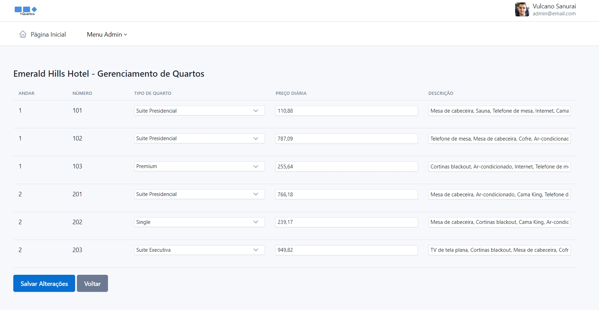

# Sistema de Reserva de Quartos de Hotel

## Objetivo do Projeto

Criar um portal, feito em Rails e Bootstrap, que permita a qualquer pessoa se cadastrar e agendar uma vaga (com data de início e fim) nos hotéis disponíveis.

O administrador do sistema poderá, dentro de uma área administrativa, criar hotéis com suas respectivas características e número de quartos.

A disponibilidade da agenda deve considerar que apenas um hóspede pode ocupar um quarto, por vez.

O sistema oferece ambientes distintos para administradores e clientes, cada um com funcionalidades específicas.

## Como vai funcionar?

### Ambiente Admin

#### Funcionalidades

    CRUD para Tipos de Comodidades: Gerenciar tipos de comodidades disponíveis nos hotéis.

    CRUD para Tipos de Quartos: Gerenciar tipos de quartos disponíveis nos hotéis.

    CRUD para Tipos de Razão de Cancelamento: Gerenciar motivos de cancelamento de reservas.

    CRUD para Hotel: Criar e manter hotéis e quartos.

    Atualizar Quartos: Complementar dados de tipos de quartos, valor da diária e descrição.

    Bloquear Quartos: Gerenciar bloqueios temporários de quartos.

    Atualizar Quartos Bloqueados: Finalizar processos de bloqueio de quartos.

### Regras de Negócio

Bloquear Quartos

    Disponibilidade: Um quarto só pode ser bloqueado em períodos sem reservas ou bloqueios.

    Motivo: Todo bloqueio deve ter um motivo.

Atualizar Quartos Bloqueados

    Finalização: Somente após a data de término, os quartos bloqueados podem ser finalizados.

Cadastro de Hotel

    Campos Obrigatórios: Nome, título, localização, e-mail, telefone, descrição, total de quartos, andares, quartos por andar, endereço, imagens e comodidades.

    Consistência: O número total de quartos deve ser consistente com o número de andares e quartos por andar.

    Geração Automática: Quartos são gerados automaticamente após a criação do hotel.

    Bloquear quartos: Opção de bloqueio para cada hotel".

Cadastro de Quarto

    Campos Obrigatórios: Número do quarto, andar, descrição, status, hotel, tipo de quarto, preço diário.

    Status: O status do quarto deve ser um dos valores permitidos (available, reserved, maintenance, disabled, unavailable).

Cadastro de Tipos de Quarto

    Descrição: A descrição do tipo de quarto é obrigatória e deve ser única.

Cadastro de Comodidades

    Descrição: A descrição da comodidade é obrigatória e deve ser única.

Cadastro de Motivos de Cancelamento

    Campos Obrigatórios: Nome, descrição, status (ativo ou inativo).

Cadastro de Bloqueio de Quarto

    Campos Obrigatórios: Quarto, data de início, data de término, motivo, status.

    Disponibilidade: Verificação de conflitos com outras reservas ou bloqueios.

### Algumas views de Admin

. Pagina Principal

. Tipos de quartos

. Tipos de razão de cancelamento

. Lista de hoteis

. Quartos do hotel

. Bloqueio de quartos

### Ambiente Cliente

#### Funcionalidades

    Criar Conta de Acesso: Utilização da gem Devise para gerenciamento de login e registro.

    Fazer Reservas: Escolha de hotel, quarto, forma de pagamento e confirmação da reserva.

    Cancelar Reservas: Cancelamento de reservas com status "reserved" até um dia antes da data de início.

    Enviar Dúvidas: Envio de mensagens para o hotel.

    Pesquisar Hotéis: Pesquisa por nome do hotel.

    Ver Histórico de Reservas: Visualização de todas as reservas, do mais recente para o mais antigo.

### Regras de Negócio

Criar Conta de Acesso

    Campos Obrigatórios: E-mail, nome, senha.

    Autenticação: Autenticação por e-mail e senha.

Fazer Reservas

    Autenticação: O cliente deve estar autenticado.

    Sequência: Escolha do hotel, quarto, forma de pagamento e confirmação da reserva.

    Disponibilidade: Apresentação de quartos disponíveis para o período escolhido.

    Forma de Pagamento: Opções de cartão de crédito, boleto e PIX.

    Confirmação: Geração de código de reserva e envio de e-mail com os detalhes.

Cancelar Reservas

    Condições: Somente reservas com status "reserved" até um dia antes da data de início.

    Motivo: Obrigatório fornecer o motivo do cancelamento.

Enviar Dúvidas

    Campos Obrigatórios: Todos os dados do formulário.

    Armazenamento: As mensagens não são armazenadas.

Pesquisar Hotéis

    Pesquisa: Por nome do hotel.

Ver Histórico de Reservas

    Visualização: Todas as reservas, do mais recente para o mais antigo.

    Cancelamento: Opção de cancelamento para reservas com status "reserved".

### Algumas views de Cliente

. Pagina Principal Cliente

. Lista de hoteis

. Detalhes do hotel

. Reserva de quarto

. Pagamento reserva

. Concluir reserva

. Confirmação reserva

. Historico reservas

. Cancelamento reserva

## Como iniciar o projeto

Para executar esse projeto você deve ter um computador, preferencialmente com
Linux, com a linguagem de programação Ruby na versão 3.3.4, framework Ruby on Rails 7.2.1 e banco de dados Postgresql

Dentro do diretório do projeto, você deve instalar as dependências definidas no
arquivo `Gemfile` com o comando `bundle install`.

. Gems instaladas

- gem "image_processing", "~> 1.2"
- gem "simple_form"
- gem "pagy"
- gem "devise", "~> 4.9"
- gem "ransack", "~> 4.1"
- gem "dotenv-rails"
- gem "faker"
- gem 'letter_opener'
- gem "tty-spinner"
- gem "money-rails", "~> 1.15"

OBS: Estou usando a gem dotenv-rails, então e necessario ajustar o config/database.yml; de acordo com suas configurações do seu banco de dados Postgresql.

Criação da base de dados

- rails db:create
- rails db:migrate
  - OBS: Caso queira popular a base de dados para as tabelas RoomType, Hotel, Amenity, CancellationReason, antes na model de Room, comentar a linha "after_create :create_rooms", e
    executar no terminal "rails dev:reset",
    depois na model de Room, descomentar a linha "after_create :create_rooms".
- rails db:seed para criar usuario admin
  - OBS: Sempre que executar no terminal "rails dev:reset" NÃO precisa executar "rails db:seed"

Com todas dependências instaladas, execute no terminal ./bin/dev, e acesse
`http://localhost:3000` no seu navegador, para pagina principal.

`http://localhost:3000/admin/login` no seu navegador, para area administrativa.

Login para area administrativa

- email => admin@email.com password => 12345678

Contribuição

Contribuições são bem-vindas! Sinta-se à vontade para melhorar o sistema.
